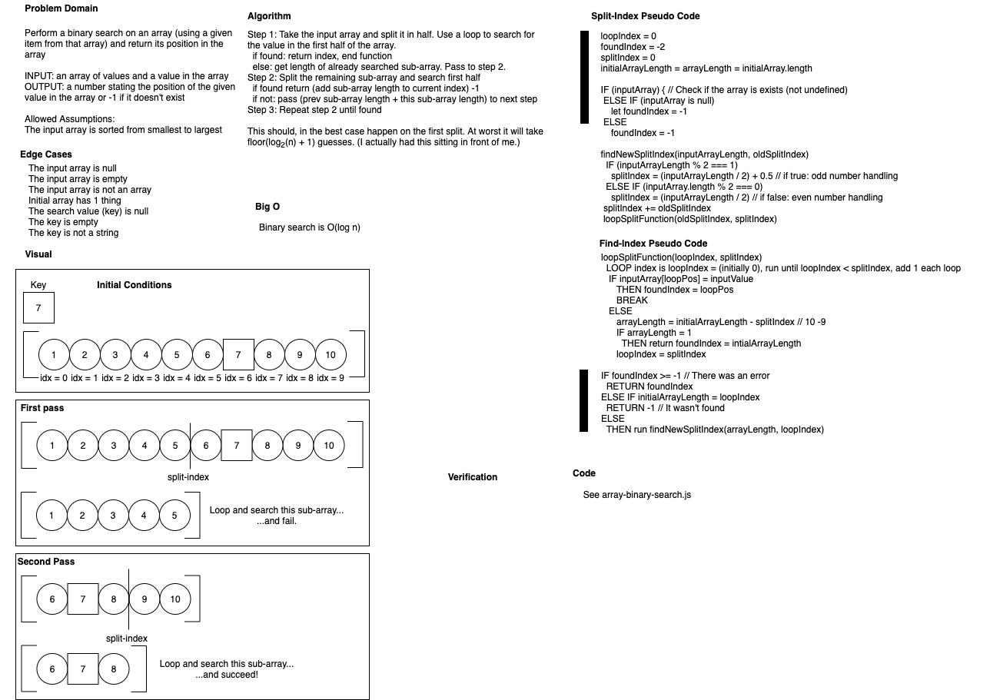

# Array Binary Search
Authors: Jeremy Penning & Simon Panek

## Challenge Description
Given an ordered array of values and a key value, use binary search to output the index of the key value if it exists in the array.

## Approach & Efficiency
Our solution involves splitting the array in half and checking the first half of the index positions for a match with the key. If found it returns the index position. If not, it recursively runs the same logic on the remaining index positions. When the key is found its current index is added to the sum of all previous sub arrays. If the length of the final sub array is one and the key is not found it returns -1 to indicate that it is not in the array.

## Solution
