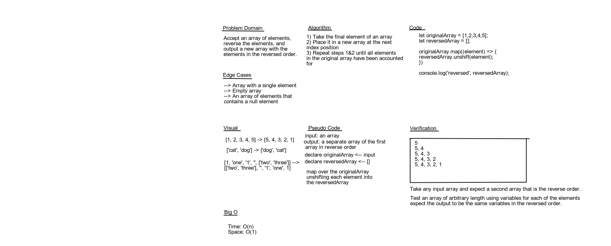

# Reverse an Array

## Challenge
The objective of this challenge is to accept an array and output a new array with its contents in the reversed order.

## Approach & Efficiency
We used array.map to unshift each element of the input array to create the output array.

## Solution

## Authors

- Garrett Cintron
- Simon Panek
