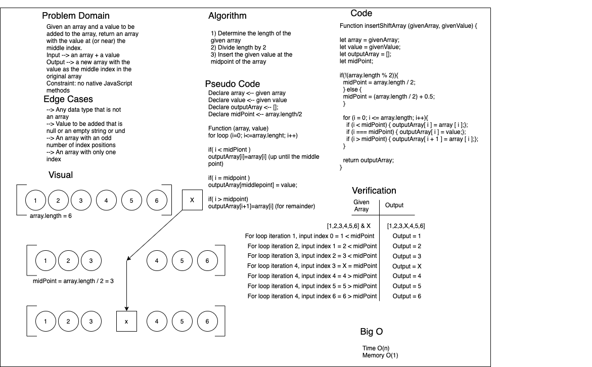

# ArrayShift
Authors: Nathan Cox & Simon Panek

## Challenge Description
Given an array of varying length and random data types along with a second value, return an array with the second value placed in the middle index position of the first.

## Approach & Efficiency
We created a variable called midPoint that determined the middle index position of the original array and used it to define a set of if statements inside a loop. Inside the loop the output array was built from the original array, second value, and original array based on index position which was controlled by the if statements.

## Solution

