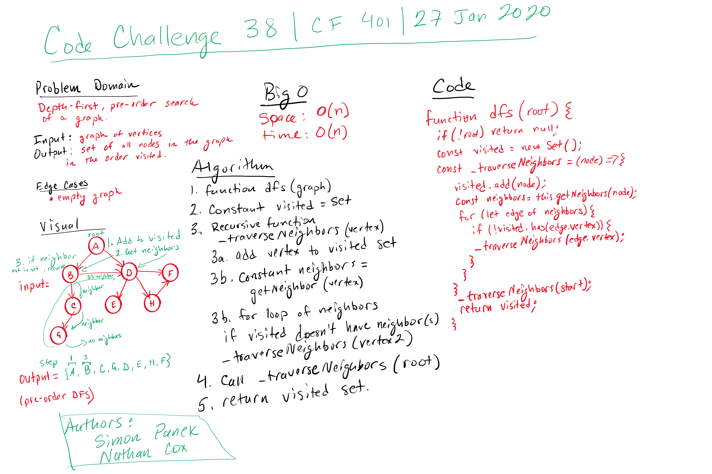

# Challenge Summary

## Authors: Simon Panek, Lena Eivy, Nathan Cox

## Challenge Description

A method that given an adjacency list returns the vertices of a graph in depth first order.

## Approach & Efficiency

This solution uses recursion to visit each vertex and a set to keep track of each unique vertex that is in the graph.

This solution has a Big (O) for time complexity of O(n^2) and for space complexity of O(n).

## Solution

