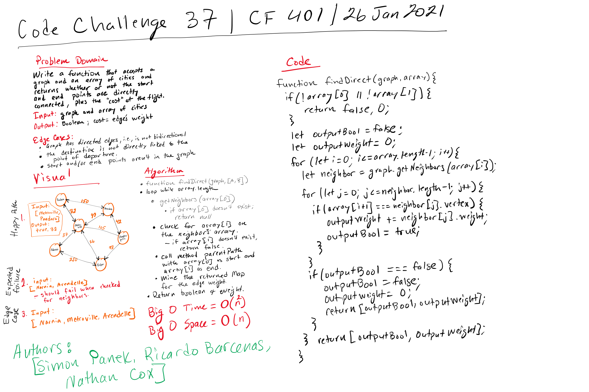

# Challenge Summary

## Authors: Simon Panek, Nathan Cox, Ricardo Barcenas

## Challenge Description

Graph method that takes in an array of vertices and returns True if they are direct neighbors and sums their edge weights. Returns False and Zero if not.

## Approach & Efficiency

This method uses the preconstructed graph methods of `getNeighbors()` and `pathTo()` in order to check if two vertices are connected by an edge and to sum their edge weights.

Space Complexity = O(n)
Time Complexity = O(n^2)

## Solution

