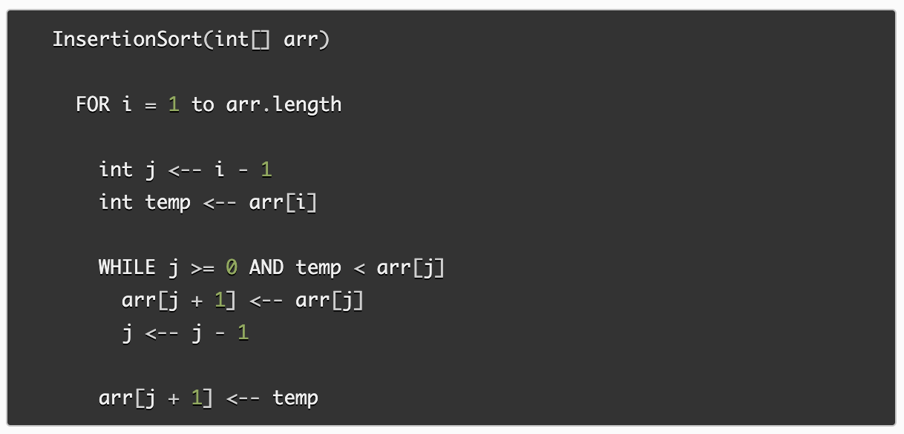
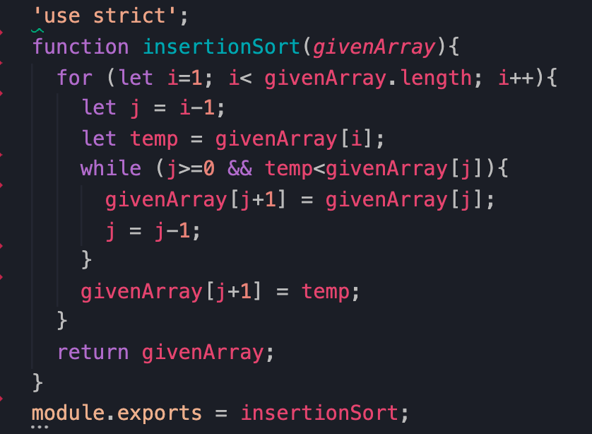

# Insertion Sort

Insertion sort is an algorithm that reorders an array in place so that the values are ordered from lowest to hightest. During each step in the process the current index value is compared to its following values. If a following value is lower it will swap places, if not it will remain in its current index position.

## Pseudocode from [CF Assignment](https://canvas.instructure.com/courses/2443160/assignments/18783460)

## Trace

Sample Array: `[8,5,7]`

### Pass 1

     [8,5,7]
idx = 0,1,2

- i=1
- j=0
- temp=5
- givenArray[1]=8
- j=-1
- givenArray[0]=5

During the first pass, index position 1 is assigned to the temp variable (5). Since j is equal to 0 and the temp (5) is < array[0] (8) the while loop is entered. The array position 1 is then assigned the value of the current array position 0 (8). j is then decremented. After exiting the while loop the array position 0 is assigned the temp value (5).

At the end of the first pass the array is `[5,8,7]`.

### Pass 2

     [5,8,7]
idx = 0,1,2

- i=2
- j=1
- temp=7
- givenArray[2]=8
- j=0
- givenArray[1]=7

During the second pass, index position 2 is assigned to the temp variable (7). Since j is equal to 1 and the temp (7) is < array[1] (8) the while loop is entered. The array position 2 is then assigned the value of the current array position 1 (8). j is then decremented. After exiting the while loop the array position 1 is assigned the temp value (7).

At the end of the second pass the array is `[5,7,8]`.

### Pass 3

     [5,7,8]
idx = 0,1,2

- i=3

On the third pass, i = 3 which is not less than the array.length. As such the for loop is not entered and the algorithm proceeds to the final line: `return givenArray`.

The sorted array is returned: `[5,7,8]`.

## Efficiency

- Time: O(n^2) --> Since each part of the algorithm must assess all index positions of the array the time required will be the length of the array times the length of the array (n*n) = n^2

- Space: O(1) --> No additional memory is used since the array is being sorted in place

## Working Code

