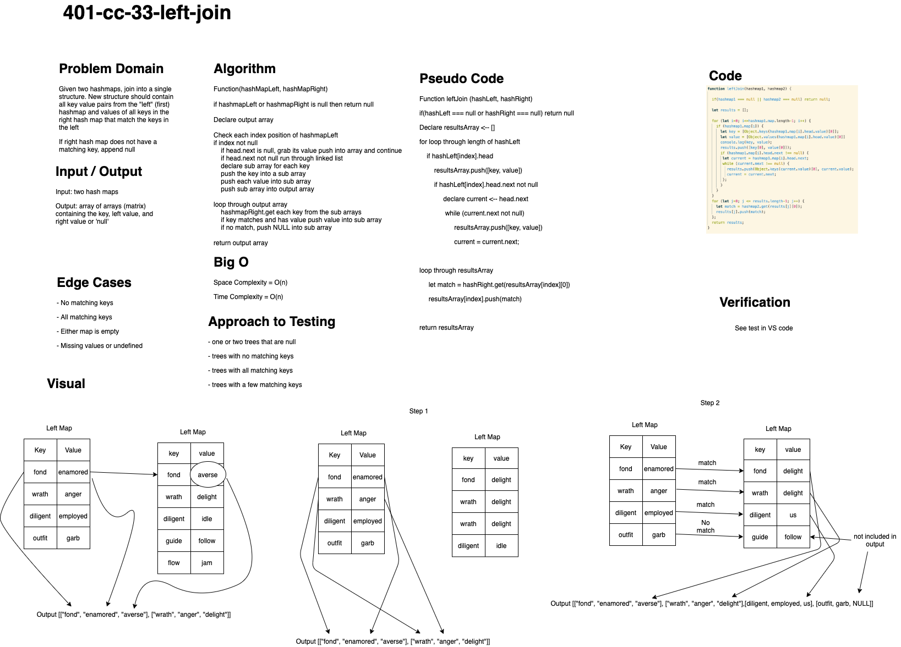

# Hashmap LEFT JOIN

## Authors: Simon Panek, Nathan Cox, Ricardo Barcenas

## Challenge

Accept two hashmaps and combine the contents of each in a third data structure. Return all contents of the first hashmap and append the values from the matching keys of the second hashmap.

## Approach & Efficiency

This function stores all key value pairs from the left hashmap in an array then loops through the array and compare each key to the right hash map.

O(n) for both time and space complexity.

## Solution

