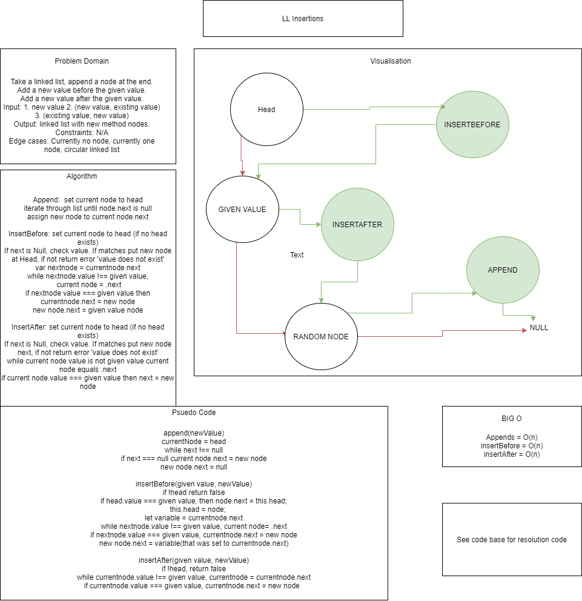

# Singly Linked List

## Author: Simon Panek

## Contributors and Collaborators: Ricardo, Nicco, and Cait!

## Challenge

Create a class that will allow the creation of linked lists. It should allow a new node to be created, a list to be searched for matching contents, and a string of the entire list to be generated, a node to be appended, and nodes to be added before or after a target node.

## Approach 

This solution creates a class for a singular node and a class for a linked list. Six methods allow interaction with the linked list.

## API & Efficiency

- `insert()` - Inserts a new node at the head of the list and operates with and efficiency of O(1).

- `includes()` - Searches the list and returns true if a given value is present in the list. This method operates with an efficiency of O(n).

- `toString()` - This method returns the values of all nodes in order as formatted string. It operates with an efficiency of O(n).

- `append()` - Adds a node with given `value` to the end of the list. It operates with an efficiency of O(n).

- `insertBefore()` - Adds a new node with given `newValue` immediately before the first `value` node. It operates with an efficiency of O(n).

- `insertAfter()` - Adds a new node with given `newValue` immediately after the first `value` node. It operates with an efficiency of O(n).

## Whiteboard

