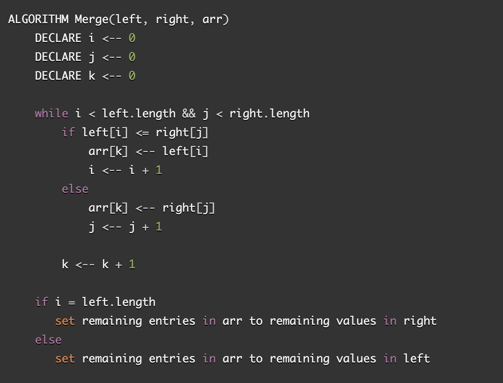

# Merge Sort

This algorithm splits the original array in to equal or near equal parts and repeats this splitting until only two values are left in each sub-array. At this point the two values are compared and ordered. The two nearest sub-arrays are then merged so that their values are all in order. This is repeated until the entire array has been rebuilt in order.

## Pseudocode from [CF Assignment](https://canvas.instructure.com/courses/2443160/assignments/18783461)

## Visual

Sample Array: [7,3,9,6,5,4,1,8]

Step: 1 _mergeSort (Split the array in half)

[7,3,9,6] [5,4,1,8]

Step: 2 _mergeSort (Split the sub-arrays in half)

[7,3] [9,6] [5,4] [1,8]

Step: 3 _mergeSort (Continue splitting recursively until all sub-arrays are single values)

[7] [3] [9] [6] [5] [4] [1] [8]

Step: 4 merge (Compare each pair of values and join them into a single ordered sub-array)

[3,7] [6,9] [4,5] [1,8]

Step: 5 merge (Compare each value in each paired sub-array and join into a single ordered array)

[3,6,7,9] [1,4,5,8]

Step: 6 merge (Compare each value in each paired sub-array and join into a single ordered array)

[1,3,4,5,6,7,8,9]

Step: 7 return the sorted array

## Efficiency

- Time: O(nlogn) --> The number of times that the array can be split in half before reaching a single value will be related to the length of the array in terms of log n, but the merging will also take some time and it will be linearly proportional to the length of the array so the overall assessment will time relationship will be n log n.

- Space: O(n) --> The construction of sub arrays will have a linear space requirement as it relates to the length of the given array.

## Working Code

Solution provided by [Medium.com](https://medium.com/javascript-in-plain-english/javascript-merge-sort-3205891ac060)

