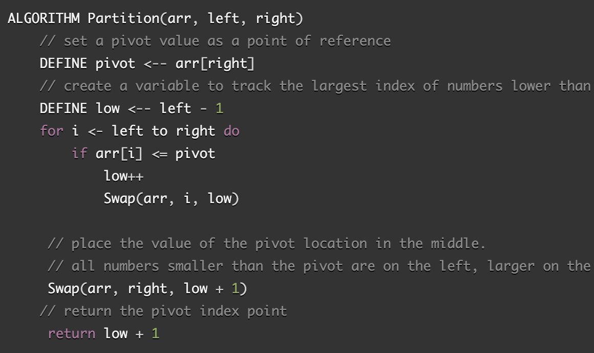

# Merge Sort

This algorithm splits the original array in to equal or near equal parts and creates a pointer at either end of the array. The left pointer is compared to the pivot (middle value) if it is less than the pivot it stays where it is and the pointer moves one to the right. If the left pointer points to a value greater than the pivot, the right pointer value is compared to the pivot. If the right pointer value is greater than the pivot the right pointer moves one index to the left and compares again. If the left pointer indicates a value greater than the pivot and the right pointer indicates a value less than the pivot then the two values swap positions. This is repeated until the pointers meet in the middle. At this point the function recurses on the left half and right half of the partially sorted array. This continues until all values are in order.

## Pseudocode from [CF Assignment](https://canvas.instructure.com/courses/2443160/assignments/18783462)

## Visual

Sample Array: [8,4,23,42,16,15]

Step 1: Select a pivot (16)

[8,4,23,42,*16*,15]

Step 2: Set left pointer (LP) to index position 0

[8LP,4,23,42,*16*,15]

Step 3: Compare LP to Pivot

8 < 16 = true so 8 stays where it is

Step 4: Move the LP one position right and compare again

[8,4LP,23,42,*16*,15]

4 < 16 = true so 4 stays where it is

Step 5: Move the LP one position right and compare again

[8,4,23LP,42,*16*,15]

23 < 16 = false so it needs to swap to the other side

Step 6: Set right pointer (RP) to index position 5

[8,4,23LP,42,*16*,15RP]

Step 7: Compare RP to Pivot

15 > 16 = false so it needs to swap to the other side

Step 8: Swap the values at LP and RP

[8,4,15LP,42,*16*,23RP]

Step 9: Move the pointers one place to the right and left

[8,4,15,42LP,*16*RP,23]

42 < 16 = false, so 42 needs to move to the other side

Step 10: swap the LP and RP values

[8,4,15,*16*LP,42RP,23]

Step 11: Split the array into the sub arrays below and above the pivot

[8,4,15] *16* [42, 23]

Step 12: Assign a new pivot to the left sub-array

[*8*,4,15]

Step 13: Assign the LP and RP

[*8*LP, 4, 15RP]

Step 14: Compare LP and RP to pivot, swap places if needed

[4,*8*LP,15RP]

Step 15: Assign a new pivot to the right sub-array

[*42*,23]

Step 16: Assign the LP and RP

[*42*LP,23RP]

Step 17: Compare LP and RP to pivot, swap places if needed

[23LP,*42*RP]

Step 18: Concat the left sub-array, original pivot, and right sub-array

[4,8,15] + [16] + [23,42]

Step 19: Return the sorted array

[4,8,15,16,23,42]

## Efficiency

- Time: O(nlogn) --> The number of times that the array can be split in half before reaching a single value will be related to the length of the array in terms of log n, but the merging will also take some time and it will be linearly proportional to the length of the array so the overall assessment will time relationship will be n log n.

- Space: O(1) --> This method reorders the array in place which does not require additional space to accomplish.

## Working Code

Solution provided by [Guru99](https://www.guru99.com/quicksort-in-javascript.html)

