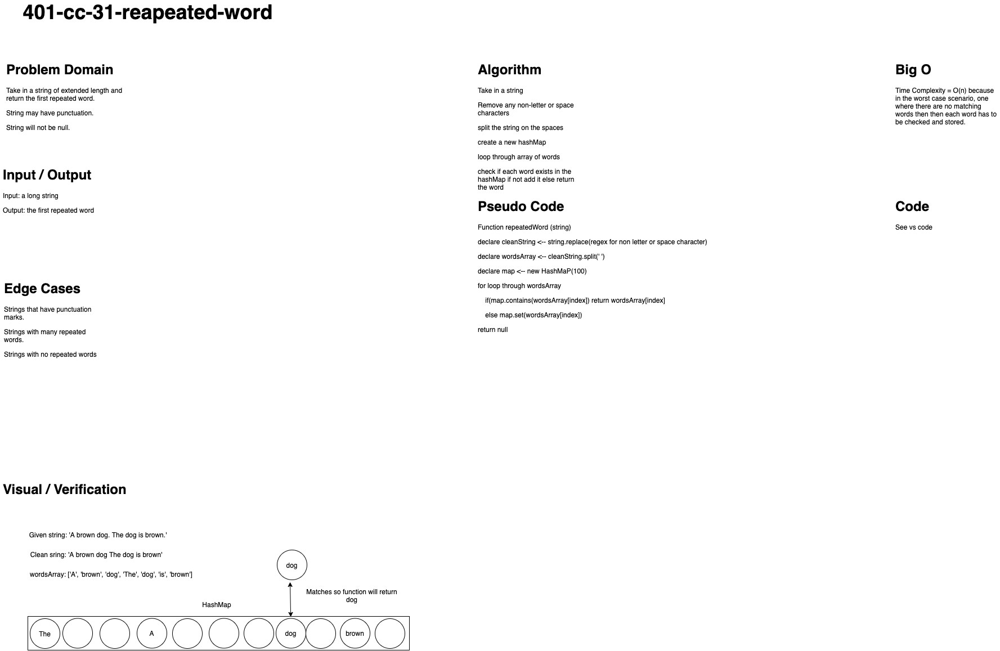

# Challenge Summary

## Author: Simon Panek

### Collaborators: Markio, Ricardo, Garrett, Nathan

## Challenge Description

Create a function that takes in a string and returns the first repeated word.

## Approach & Efficiency

O(n) for both time and space because in the worst case scenario every word in the string will have to be checked and stored.

## Solution

