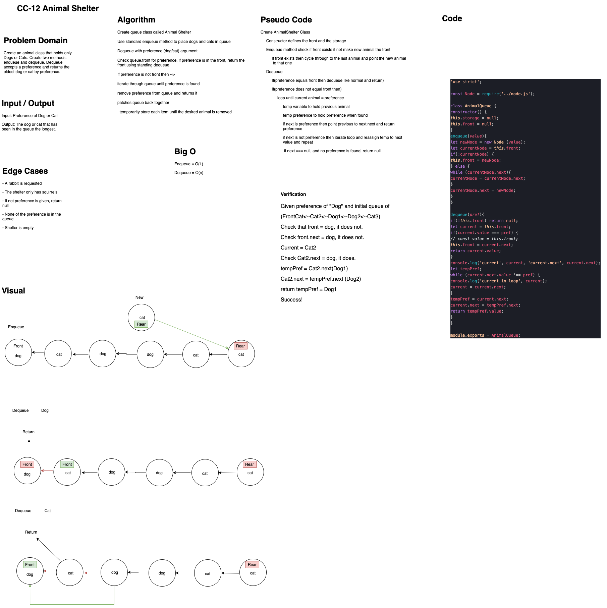

# Challenge Summary

## Authors: Simon Panek, Ricardo Barcenas, Mariko Alvarado

## Challenge Description

Create a queue class that has two methods

## Approach & Efficiency

- `enqueue()` Adds a Cat or a Dog to the queue (operates with O(1))
- `dequeue(pref)` Returns which ever dog or cat has been in the queue the longest based on the preference (operates with O(1))

## Solution

