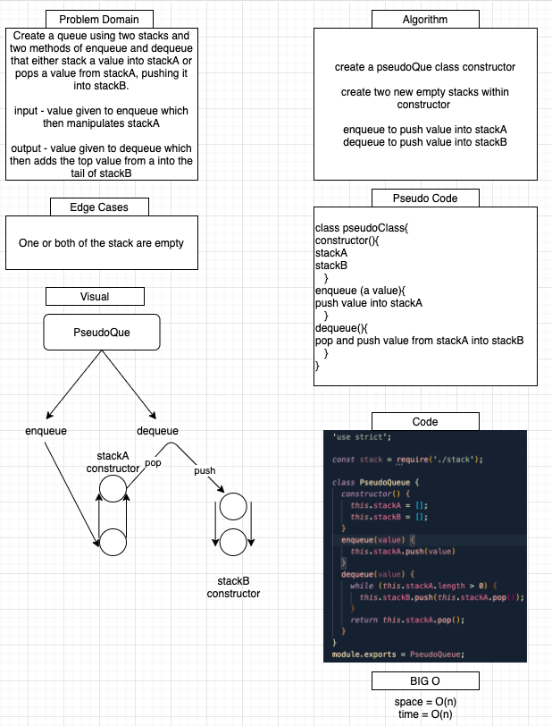

# Challenge Summary

## Authors: Simon Panek, Ricardo Barcenas, Mariko Alvarado, Nathan Rhead Cox

## Resources

[Algorithm supplied by Coderbyte](https://coderbyte.com/algorithm/implement-queue-using-two-stacks)

## Challenge Description

Implement a queue using two stacks

## Approach & Efficiency

- This app defines a class called PseudoQueue that has two methods. 
  - `enqueue(value)` which operates with a space efficiency of O(1) and a time efficiency of O(n)
  - `dequeue()` which operates with a space efficiency of O(1) and a time efficiency of O(n)

## Solution

